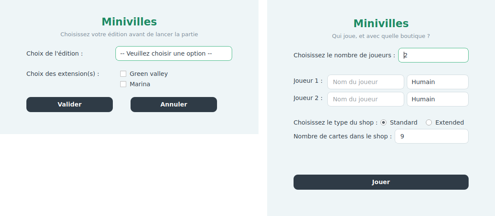

# Machi Koro — Qt

Implémentation en **C++ / Qt6** du jeu de société *Machi Koro* (*Minivilles* en
français), réalisée dans le cadre du projet de l'UV **LO21** à l'Université de
Technologie de Compiègne.

Chaque joueur développe sa ville : on lance les dés, les bâtiments dont le
numéro sort produisent des revenus, et l'argent gagné sert à acheter de
nouvelles cartes ou à construire des monuments. Le premier joueur à avoir
construit tous les monuments requis par l'édition remporte la partie.


## Sommaire

- [Fonctionnalités](#fonctionnalités)
- [Déroulement d'un tour](#déroulement-dun-tour)
- [Éditions et extensions](#éditions-et-extensions)
- [Les cartes](#les-cartes)
- [Compilation](#compilation)
- [Exécution](#exécution)
- [Organisation du dépôt](#organisation-du-dépôt)
- [Auteurs](#auteurs)
- [Licence](#licence)

## Fonctionnalités

- Trois éditions jouables : **Standard**, **Deluxe** et **Custom**
- Deux extensions greffables sur l'édition Standard : **Marina** et **Green Valley**
- Quatre familles de bâtiments — bleu, vert, rouge et violet — aux règles d'activation distinctes
- Huit monuments, dont les effets modifient le déroulement du tour (second dé, relance, rejouer…)
- Multijoueur local : 2 à 4 joueurs, ou jusqu'à 5 en édition Deluxe
- Adversaires contrôlés par l'ordinateur, avec trois profils : agressif, défensif ou aléatoire
- Boutique paramétrable : nombre de piles visibles limité, ou catalogue complet
- Pioche mélangée à chaque partie et réapprovisionnement automatique de la boutique
- Interface graphique Qt6 : un plateau unique où tout est visible en permanence — la boutique, les villes de tous les joueurs, leurs monuments et leur bourse
- Le tour se déroule sous les yeux du joueur : chaque carte qui produit son effet s'allume chez ceux qu'elle concerne, s'affiche en grand et annonce ce qu'elle vient de faire

## Déroulement d'un tour

1. **Lancer des dés** — un dé par défaut, deux si le joueur a construit la Gare et choisit de les lancer.
2. **Effets des monuments** — la Tour radio permet de relancer, le Port d'ajouter 2 à un résultat d'au moins 10.
3. **Revenus**, dans l'ordre des couleurs (voir ci-dessous).
4. **Phase d'achat** — un bâtiment de la boutique, un monument, ou rien.
5. **Fin de tour** — le joueur rejoue s'il a fait un double et possède le Parc d'attractions.

Ces cinq temps sont affichés en haut du plateau et se cochent au fur et à
mesure : on sait toujours où l'on en est. Pendant les temps de revenus, seules
les cartes que l'étape peut activer restent en pleine couleur ; les autres
s'estompent. La carte qui se déclenche se relève et s'entoure d'un halo doré
chez **chacun** des joueurs qu'elle concerne, s'affiche en grand dans le panneau
de droite, et les pièces traversent le plateau du payeur vers le bénéficiaire.

## L'interface

Tout tient sur un seul écran, sans navigation ni fenêtre à ouvrir :

| Zone | Contenu |
|---|---|
| **En haut** | Le rail des cinq temps du tour, et le profil de la partie |
| **Bande supérieure** | Une ville par adversaire : avatar, bourse, monuments, établissements rangés par numéro d'activation |
| **Au centre, sur le tapis** | La boutique — de 9 à 39 piles, la taille des cartes s'adapte — les dés et la pioche |
| **Bande inférieure** | La ville complète du joueur dont c'est le tour : ses huit monuments et tous ses établissements, à taille lisible |
| **À droite** | Le journal du tour, et le panneau qui montre en grand la carte survolée, choisie, ou en train de produire son effet |

Survoler n'importe quelle carte du plateau — y compris chez un adversaire — la
redresse, l'agrandit et l'affiche en entier dans le panneau de droite : ses
numéros d'activation, son prix, sa famille et son texte. Les couleurs seules ne
suffisent pas à décider, et le détail d'une ville adverse est souvent ce qui
oriente un achat.

Construire se fait en deux gestes : cliquer la carte, puis le bouton
**Construire**. Un établissement hors de portée reste visible mais voilé ; un
établissement fermé est couché à 90 degrés, comme le prescrit le livret, et
continue de compter pour les cartes qui dénombrent.




## Éditions et extensions

| Édition | Joueurs | Monuments à construire | Contenu |
|---|---|---|---|
| **Standard** | 2 à 4 | 4 | Le jeu de base : 15 bâtiments différents, 4 monuments |
| **Deluxe** | 2 à 5 | 5 | Version française condensée : reprend le Standard et une partie des extensions |
| **Custom** | 2 à 6 | 6 | Toutes les cartes de toutes les éditions, plus deux cartes inédites |

Ajouter l'extension **Marina** à l'édition Standard porte la condition de
victoire à **6 monuments**, comme le prescrit son livret : elle apporte le Port
et l'Aéroport. L'Hôtel de ville, distribué déjà construit, ne compte pas dans ce
total. **Green Valley** n'apporte aucun monument et laisse la condition à 4.

Les deux extensions ne se greffent que sur l'édition **Standard** ; les éditions
Deluxe et Custom intègrent déjà leur contenu.

| Extension | Apports notables |
|---|---|
| **Marina** | Le Port et l'Aéroport, deux monuments de plus à construire, ainsi que l'Hôtel de ville, offert construit dès le départ ; les cartes maritimes (Petit bateau de pêche, Chalutier, Sushi bar) dont l'effet dépend du Port |
| **Green Valley** | 13 établissements : l'Arboretum, l'Entreprise de rénovation et la Startup ; la Cave à vin, le Champ de maïs, le Club privé, le Restaurant 5 étoiles. Introduit les établissements **fermés**, qui ne produisent plus d'effet jusqu'à ce que les dés les réactivent |

Le **MGA Game Center** et la **Fabrique de jouets du Père Noël** sont deux
cartes promotionnelles parues avec l'extension Minivilles 5-6 ; elles ne sont
disponibles ici que dans l'édition Custom. La Fabrique est un monument déjà
construit en début de partie : un *lancer cassé* — un dé qui ne repose pas à
plat — rapporte 3 pièces et fait relancer le même nombre de dés, une fois par
tour au maximum. Un dé basculé n'existant pas en numérique, sa survenue est
simulée par un tirage séparé, dans environ 9,6 % des tours.

## Les cartes

Chaque bâtiment porte un ou plusieurs numéros d'activation. Sa couleur détermine
*qui* encaisse quand ce numéro sort :

| Couleur | Famille | Qui gagne |
|---|---|---|
| 🟦 **Bleu** | Établissements primaires | Le propriétaire, quel que soit le joueur qui a lancé les dés |
| 🟩 **Vert** | Établissements secondaires | Le propriétaire, uniquement pendant son propre tour |
| 🟥 **Rouge** | Restaurants | Le propriétaire, prélevé sur le joueur qui a lancé les dés |
| 🟪 **Violet** | Établissements majeurs | Le propriétaire pendant son tour ; limités à un exemplaire par joueur |

Les bâtiments portent en plus un *type* (champ, bétail, engrenage, bateau,
commerce, restaurant, usine, marché, entreprise, spécial) dont se servent les
cartes qui rémunèrent « par établissement possédé » — la Fromagerie compte les
bétails, la Fabrique de meubles les engrenages, etc.

Les **monuments** ne s'activent pas aux dés : une fois construits, ils restent
acquis et modifient les règles du tour.

| Monument | Effet |
|---|---|
| Gare | Autorise le lancer de deux dés |
| Centre commercial | +1 pièce sur les établissements de type commerce et restaurant |
| Parc d'attractions | Rejouer un tour après un double |
| Tour radio | Relancer les dés une fois par tour |
| Port | +2 au résultat lorsqu'il atteint 10 |
| Aéroport | 10 pièces si rien n'a été acheté pendant le tour |
| Hôtel de ville | 1 pièce si le joueur est ruiné avant d'acheter — offert construit, il ne compte pas pour la victoire |
| Fabrique du Père Noël | 3 pièces et une relance quand le jet de dés est « cassé » — offerte construite, elle ne compte pas pour la victoire |

Chaque joueur démarre avec **3 pièces**, un **Champ de blé** et une
**Boulangerie**.

## Compilation

### Prérequis

- Un compilateur C++ supportant **C++23** (GCC 13 ou plus récent)
- **CMake ≥ 3.24**
- **Qt 6** avec les modules `Core`, `Gui`, `Widgets` et `Multimedia`

Sur Debian / Ubuntu :

```bash
sudo apt install build-essential cmake ninja-build \
                 qt6-base-dev qt6-multimedia-dev libgl1-mesa-dev
```

Sous Windows ou macOS, installez Qt 6 via l'installateur officiel, puis
indiquez son emplacement à CMake :

```bash
cmake -S . -B build -DCMAKE_PREFIX_PATH="C:/Qt/6.4.1/mingw_64/lib/cmake"
```

### Construire

```bash
cmake -S . -B build -G Ninja
cmake --build build
```

L'exécutable `Machi_Koro` est produit dans `build/`.

## Exécution

> **Important** : les chemins des images sont écrits en relatif sous la forme
> `../assets/...`. Le programme doit donc être lancé depuis un **sous-répertoire
> direct de la racine du dépôt** — le répertoire `build/` créé ci-dessus
> convient. Lancé depuis ailleurs, le jeu démarre mais les cartes, les dés et
> les monuments s'affichent vides.

```bash
cd build
./Machi_Koro
```

Au lancement, un premier menu propose de choisir l'édition et, pour l'édition
Standard, les extensions. Le second menu permet de nommer les joueurs, de
choisir pour chacun s'il est humain ou piloté par l'ordinateur, et de régler la
boutique.

## Organisation du dépôt

```
cartes/          Modèle des cartes
  batiment/        Bâtiments, un fichier par carte, rangés par couleur
  monument/        Monuments
  Carte.*          Classe de base, VueCarte.* pour l'affichage
controleur/      Moteur de jeu et vues associées
  Partie.*         Déroulement de la partie (singleton)
  EditionDeJeu/    Composition des éditions et extensions
  Pioche.*         Pile de cartes à distribuer
  Shop.*           Boutique
  VuePartie.*      Fenêtre de jeu, façade sur la scène
  VueInfo.*        Journal de la partie
joueur/          Joueur.* — l'état d'un joueur
vue/             Le plateau
  ScenePlateau.*   Mise en page et déroulement visuel du tour
  VuePlateau.*     La QGraphicsView qui l'affiche
  ItemCarte.*      Une carte posée : survol, mise en lumière, voile, jetons
  ItemBouton.*     Un bouton dessiné dans la scène
  Decor.*          Ciel, montagnes, tapis, avatars et pièces, dessinés en Qt
  StyleJeu.*       Habillage des menus et des fenêtres de choix
exception/       gameExeption.h
assets/          Images des cartes, des monuments et des dés
docs/            Captures d'écran du README
uml-qt.puml      Diagramme de classes, hérité du projet d'origine
```

> Le diagramme `uml-qt.puml` date de la remise initiale et **ne décrit plus le
> code** : il montre encore `declencher_effet(possesseur, bonus)` et un type de
> bâtiment porté par une chaîne, remplacés depuis, et ignore le dossier `vue/`.
> Il est conservé comme trace du projet, pas comme documentation à jour.

## Auteurs

Projet LO21 réalisé par :

- [@MidoriNess](https://github.com/MidoriNess)
- [@Saucisse2toulouse](https://github.com/Saucisse2toulouse)
- [@antoine-gajan](https://github.com/antoine-gajan/)
- [@sacha-sz](https://github.com/sacha-sz/)
- [@theodubus](https://github.com/theodubus/)

## Licence

Ce projet est distribué sous licence **MIT**. Voir le fichier
[LICENSE](LICENSE).

*Machi Koro* est une création de Masao Suganuma éditée par Grounding Inc. et
Moon Rabbit ; ce dépôt est un travail universitaire sans but commercial et
n'est affilié ni à l'auteur ni aux éditeurs du jeu.
