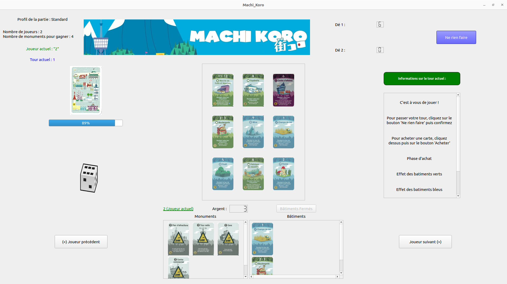

# Machi Koro — Qt

Implémentation en **C++ / Qt6** du jeu de société *Machi Koro* (*Minivilles* en
français), réalisée dans le cadre du projet de l'UV **LO21** à l'Université de
Technologie de Compiègne.

Chaque joueur développe sa ville : on lance les dés, les bâtiments dont le
numéro sort produisent des revenus, et l'argent gagné sert à acheter de
nouvelles cartes ou à construire des monuments. Le premier joueur à avoir
construit tous les monuments requis par l'édition remporte la partie.



## Sommaire

- [Fonctionnalités](#fonctionnalités)
- [Déroulement d'un tour](#déroulement-dun-tour)
- [Éditions et extensions](#éditions-et-extensions)
- [Les cartes](#les-cartes)
- [Compilation](#compilation)
- [Exécution](#exécution)
- [Organisation du dépôt](#organisation-du-dépôt)
- [Auteurs](#auteurs)
- [Licence](#licence)

## Fonctionnalités

- Trois éditions jouables : **Standard**, **Deluxe** et **Custom**
- Deux extensions greffables sur l'édition Standard : **Marina** et **Green Valley**
- Quatre familles de bâtiments — bleu, vert, rouge et violet — aux règles d'activation distinctes
- Huit monuments, dont les effets modifient le déroulement du tour (second dé, relance, rejouer…)
- Multijoueur local, de 2 joueurs jusqu'à la limite propre à chaque édition
- Adversaires contrôlés par l'ordinateur, avec trois profils : agressif, défensif ou aléatoire
- Boutique paramétrable : nombre de piles visibles limité, ou catalogue complet
- Pioche mélangée à chaque partie et réapprovisionnement automatique de la boutique
- Interface graphique Qt6 : plateau, journal de partie, animation des dés et consultation des villes adverses

## Déroulement d'un tour

1. **Lancer des dés** — un dé par défaut, deux si le joueur a construit la Gare et choisit de les lancer.
2. **Effets des monuments** — la Tour radio permet de relancer, le Port d'ajouter 2 à un résultat d'au moins 10.
3. **Revenus**, dans l'ordre des couleurs (voir ci-dessous).
4. **Phase d'achat** — un bâtiment de la boutique, un monument, ou rien.
5. **Fin de tour** — le joueur rejoue s'il a fait un double et possède le Parc d'attractions.

## Éditions et extensions

| Édition | Joueurs max. | Monuments à construire | Contenu |
|---|---|---|---|
| **Standard** | 4 | 4 | Le jeu de base : 15 bâtiments différents, 4 monuments |
| **Deluxe** | 5 | 5 | Version française condensée : reprend le Standard et une partie des extensions |
| **Custom** | 6 | 8 | Toutes les cartes de toutes les éditions, plus deux cartes inédites |

Les deux extensions ne se greffent que sur l'édition **Standard** ; les éditions
Deluxe et Custom intègrent déjà leur contenu.

| Extension | Apports notables |
|---|---|
| **Marina** | Le Port, l'Aéroport et l'Hôtel de ville ; les cartes maritimes (Petit bateau de pêche, Chalutier, Sushi bar) dont l'effet dépend du Port |
| **Green Valley** | L'Arboretum et l'Entreprise de rénovation ; la Cave à vin, le Champ de maïs, le Club privé, le Restaurant 5 étoiles |

Deux cartes n'existent que dans l'édition Custom : le **MGA Game Center**, qui
rejoue l'effet d'un de vos établissements, et la **Fabrique du Père Noël**.

## Les cartes

Chaque bâtiment porte un ou plusieurs numéros d'activation. Sa couleur détermine
*qui* encaisse quand ce numéro sort :

| Couleur | Famille | Qui gagne |
|---|---|---|
| 🟦 **Bleu** | Établissements primaires | Le propriétaire, quel que soit le joueur qui a lancé les dés |
| 🟩 **Vert** | Établissements secondaires | Le propriétaire, uniquement pendant son propre tour |
| 🟥 **Rouge** | Restaurants | Le propriétaire, prélevé sur le joueur qui a lancé les dés |
| 🟪 **Violet** | Établissements majeurs | Le propriétaire pendant son tour ; limités à un exemplaire par joueur |

Les bâtiments portent en plus un *type* (champ, bétail, engrenage, bateau,
commerce, restaurant, usine, marché, entreprise, spécial) dont se servent les
cartes qui rémunèrent « par établissement possédé » — la Fromagerie compte les
bétails, la Fabrique de meubles les engrenages, etc.

Les **monuments** ne s'activent pas aux dés : une fois construits, ils restent
acquis et modifient les règles du tour.

| Monument | Effet |
|---|---|
| Gare | Autorise le lancer de deux dés |
| Centre commercial | +1 pièce sur les établissements de type commerce et restaurant |
| Parc d'attractions | Rejouer un tour après un double |
| Tour radio | Relancer les dés une fois par tour |
| Port | +2 au résultat lorsqu'il atteint 10 |
| Aéroport | 10 pièces si rien n'a été acheté pendant le tour |
| Hôtel de ville | 1 pièce si le joueur est ruiné avant d'acheter |
| Fabrique du Père Noël | 3 pièces sur un jet de dés cassé |

Chaque joueur démarre avec **3 pièces**, un **Champ de blé** et une
**Boulangerie**.

## Compilation

### Prérequis

- Un compilateur C++ supportant **C++23** (GCC 13 ou plus récent)
- **CMake ≥ 3.24**
- **Qt 6** avec les modules `Core`, `Gui`, `Widgets` et `Multimedia`

Sur Debian / Ubuntu :

```bash
sudo apt install build-essential cmake ninja-build \
                 qt6-base-dev qt6-multimedia-dev libgl1-mesa-dev
```

Sous Windows ou macOS, installez Qt 6 via l'installateur officiel, puis
indiquez son emplacement à CMake :

```bash
cmake -S . -B build -DCMAKE_PREFIX_PATH="C:/Qt/6.4.1/mingw_64/lib/cmake"
```

### Construire

```bash
cmake -S . -B build -G Ninja
cmake --build build
```

L'exécutable `Machi_Koro` est produit dans `build/`.

## Exécution

> **Important** : les chemins des images sont écrits en relatif sous la forme
> `../assets/...`. Le programme doit donc être lancé depuis un **sous-répertoire
> direct de la racine du dépôt** — le répertoire `build/` créé ci-dessus
> convient. Lancé depuis ailleurs, le jeu démarre mais les cartes, les dés et
> les monuments s'affichent vides.

```bash
cd build
./Machi_Koro
```

Au lancement, un premier menu propose de choisir l'édition et, pour l'édition
Standard, les extensions. Le second menu permet de nommer les joueurs, de
choisir pour chacun s'il est humain ou piloté par l'ordinateur, et de régler la
boutique.

## Organisation du dépôt

```
cartes/          Modèle des cartes
  batiment/        Bâtiments, un fichier par carte, rangés par couleur
  monument/        Monuments
  Carte.*          Classe de base, VueCarte.* pour l'affichage
controleur/      Moteur de jeu et vues associées
  Partie.*         Déroulement de la partie (singleton)
  EditionDeJeu/    Composition des éditions et extensions
  Pioche.*         Pile de cartes à distribuer
  Shop.*           Boutique
  Vue*.cpp         Vues Qt du plateau, de la boutique, de la pioche, des dés
joueur/          Joueur.* (état d'un joueur) et VueJoueur.* (sa ville)
exception/       gameExeption.h
assets/          Images des cartes, des monuments et des dés
uml-qt.puml      Diagramme de classes du projet
```

## Auteurs

Projet LO21 réalisé par :

- [@MidoriNess](https://github.com/MidoriNess)
- [@Saucisse2toulouse](https://github.com/Saucisse2toulouse)
- [@antoine-gajan](https://github.com/antoine-gajan/)
- [@sacha-sz](https://github.com/sacha-sz/)
- [@theodubus](https://github.com/theodubus/)

## Licence

Ce projet est distribué sous licence **MIT**. Voir le fichier
[LICENSE](LICENSE).

*Machi Koro* est une création de Masao Suganuma éditée par Grounding Inc. et
Moon Rabbit ; ce dépôt est un travail universitaire sans but commercial et
n'est affilié ni à l'auteur ni aux éditeurs du jeu.
